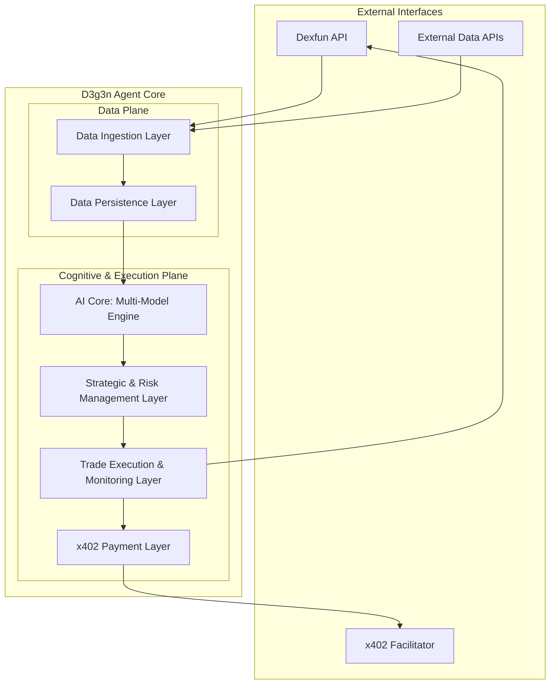
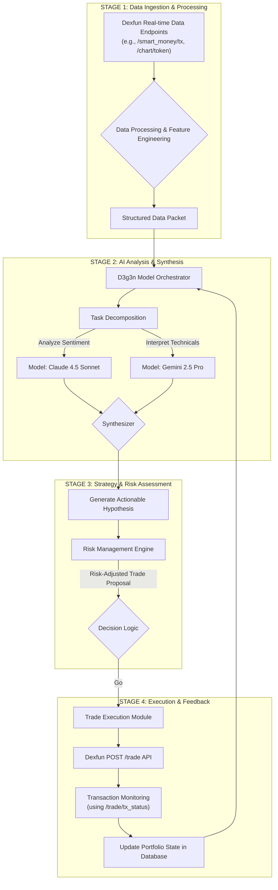
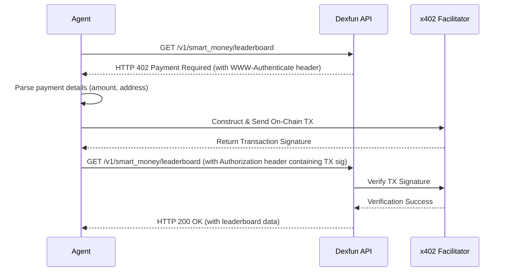
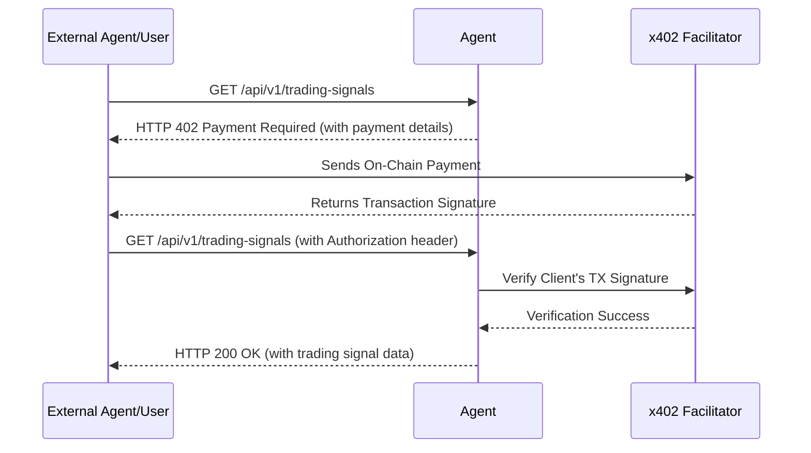

# D3g3n AI Agent: Technical Specification

## 1. Introduction

### 1.1. Project Vision & Goals

This document provides the complete technical specification for the **D3g3n AI Agent**, an autonomous system designed for advanced trading and analysis on the Solana blockchain. D3g3n is engineered to interact directly with the **Dexfun** platform, leveraging its rich data APIs to achieve a deep understanding of market dynamics.

The primary goal of D3g3n is to function as a self-sufficient economic agent. It will perform sophisticated market analysis, execute trades automatically, and manage its own operational costs by programmatically paying for data services and monetizing its own insights through the native integration of the **x402 payment protocol**.

### 1.2. Core Architectural Principles

The design of D3g3n is guided by three core principles:

1.  **Task-Specialized Intelligence**: No single AI model is optimal for all tasks. D3g3n employs a **multi-model AI core** where a central **Orchestrator** delegates cognitive tasks to the most suitable model (e.g., Gemini, Grok, Claude), balancing performance, cost, and speed.
2.  **Autonomous Operation**: The agent is designed for end-to-end autonomy, from data ingestion and analysis to trade execution and performance monitoring, with minimal human intervention.
3.  **Economic Self-Sufficiency**: Through the x402 protocol, D3g3n can participate in the machine-to-machine (M2M) economy, paying for the resources it consumes and earning revenue from the intelligence it generates.

### 1.3. Technology Stack

| Component | Technology | Rationale |
| :--- | :--- | :--- |
| **Core Logic** | Python 3.10+ | Mature ecosystem for AI/ML, data science, and web frameworks. |
| **AI/ML** | TensorFlow, PyTorch, Scikit-learn, LangChain | Standard libraries for model development and agentic workflows. |
| **Data Source** | Dexfun API (`https://server.dexfun.ai/v1`) | Primary source for real-time and historical market data. |
| **Payment Protocol** | x402 | Open standard for on-chain, programmatic HTTP payments. |
| **Data Persistence** | PostgreSQL, MongoDB, Clickhouse, BigQuery | A powerful, polyglot persistence stack for relational, document, real-time analytics, and data warehousing needs. |
| **Deployment** | Docker, Kubernetes | Containerization for portability and orchestration for scalability. |

### 1.4. Dexfun API Overview

The D3g3n agent's intelligence is fundamentally dependent on the breadth and depth of the Dexfun API. The API, hosted at `server.dexfun.ai/v1`, provides a comprehensive suite of endpoints that can be categorized into four main functional groups.

#### 1.4.1. Market & Token Data Endpoints
This group of endpoints provides the core data necessary for market analysis, token discovery, and technical analysis.
-   **Core Token Information**: `GET /token/info` provides detailed metadata for a specific token.
-   **Time-Series Data**: `GET /chart/token` is crucial for fetching historical price and volume data (candlesticks), which forms the basis of all technical analysis and predictive modeling.
-   **On-chain Statistics**: `GET /token/stats` offers a rich set of on-chain metrics, including holder statistics, buy/sell pressure, and detailed information about different classes of traders (devs, insiders, etc.).
-   **Discovery & Search**: Endpoints like `GET /token/get_new_creation` and `GET /token/search` allow the agent to discover new assets and search for specific tokens or users.

#### 1.4.2. Smart Money & User Intelligence Endpoints
This category is a high-value source of alpha, allowing D3g3n to model and learn from the behavior of successful market participants.
-   **Leaderboards**: `GET /smart_money/leaderboard` provides a curated list of top-performing wallets, which is a primary input for identifying successful strategies.
-   **Real-time Activity**: `GET /smart_money/tx` delivers a stream of transactions from wallets identified as "smart money," allowing the agent to react quickly to market movements from key players.
-   **User-Specific Data**: Endpoints like `GET /user/info` and `GET /user/pnl_chart` allow for the analysis of individual trader performance over time.

#### 1.4.3. Trade Execution Endpoints
This group provides the "hands" for the agent, allowing it to act on its analytical conclusions.
-   **Core Trading Function**: `POST /trade` is the primary endpoint for executing buy and sell swaps on-chain.
-   **Order & Position Management**: The API includes functions for managing limit orders (`POST /trade/create_limit_order`, `PUT /trade/cancel_limit_order`) and checking the agent's current position in a token (`GET /trade/position`).
-   **Transaction Monitoring**: `GET /trade/tx_status` is used to confirm that a trade has been successfully executed on the blockchain.

#### 1.4.4. Social & Auxiliary Endpoints
This group provides supplementary data that can be used to enrich the agent's understanding of market sentiment.
-   **Social Media Integration**: The `GET /social/x/*` endpoints allow the agent to fetch profile information and posts from X (Twitter), which can be fed into sentiment analysis models.

This rich and varied API surface is what enables the sophisticated, multi-layered analysis performed by the D3g3n agent.

---

## 2. System Architecture

### 2.1. High-Level Architectural Diagram

The system is composed of several interconnected layers, ensuring a modular and scalable design.

### 2.2. Component Breakdown

#### 2.2.1. Data Ingestion Layer
-   **Function**: Acts as the sensory input for the agent. It is responsible for collecting all required data from both internal and external sources.
-   **Details**:
    -   Establishes persistent websocket connections to Dexfun for real-time data streams (if available).
    -   Performs scheduled polling of Dexfun REST API endpoints for market data, on-chain analytics, and smart money movements.
    -   Connects to third-party APIs for supplementary data like global news or social media sentiment.
    -   Performs initial data cleaning, normalization, and feature engineering (e.g., calculating technical indicators like RSI, MACD).

#### 2.2.2. Data Persistence Layer
-   **Function**: Provides a robust, polyglot persistence architecture to handle the diverse data types and query patterns required by the agent. Each database is chosen for its specific strengths.
-   **Details**:
    -   **Clickhouse**: Used for ingesting and storing high-volume, time-series market data (trades, order books, ticks) and for real-time analytical queries (e.g., calculating moving averages on the fly). Its columnar nature is ideal for the fast aggregations needed during analysis.
    -   **MongoDB**: Stores unstructured and semi-structured data, such as news articles, social media posts (from X), and sentiment analysis results. Its flexible document model is perfect for this type of data.
    -   **PostgreSQL**: Serves as the primary transactional database. It stores core relational data, including the agent's trade history, configuration settings, user data (if applicable), and the ledger of x402 transactions.
    -   **BigQuery**: Acts as the central data warehouse. Periodically, data from Clickhouse, MongoDB, and Postgres is ETL'd into BigQuery for large-scale, complex analytical queries and, most importantly, as the primary data source for training and retraining AI/ML models.

#### 2.2.3. AI Core: The Multi-Model Engine
-   **Function**: The central intelligence of D3g3n. It analyzes data and generates insights by dynamically delegating tasks to a suite of specialized AI models.
-   **Components**:
    -   **Model Orchestrator**: An intelligent router that receives an analysis task, decomposes it into sub-tasks, and routes each sub-task to the most appropriate AI model based on a cost-benefit analysis.
    -   **Specialized AI Models**: A collection of LLMs and other models (see Section 4) accessible via API calls.
    -   **Synthesizer Module**: Aggregates the outputs from the various models (e.g., sentiment scores, technical summaries, event contexts) to form a single, coherent, and actionable trading hypothesis.

#### 2.2.4. Strategic & Risk Management Layer
-   **Function**: Translates the AI's hypothesis into a concrete, risk-assessed trading plan.
-   **Details**:
    -   Receives the actionable hypothesis from the AI Core (e.g., "Token X has a high probability of a 15% price increase in the next 4 hours").
    -   Applies pre-configured trading strategies (e.g., momentum, mean reversion).
    -   The **Risk Management Engine** calculates critical parameters: position size, entry price, stop-loss, and take-profit levels, ensuring adherence to overall portfolio risk limits.
    -   The **Decision Logic** gives the final "go/no-go" signal for the trade.

#### 2.2.5. Trade Execution & Monitoring Layer
-   **Function**: Manages the lifecycle of a trade, from placing the order to tracking its completion.
-   **Details**:
    -   Constructs and sends API requests to the Dexfun `POST /trade` endpoint to execute swaps with low latency.
    -   Leverages advanced features available through the trading API, such as slippage parameters.
    -   Continuously monitors the transaction status on the Solana blockchain using the `GET /trade/tx_status` endpoint.
    -   Updates the Data Persistence Layer with the trade's outcome.
    -   Provides real-time feedback to the AI Core, forming a crucial learning loop.

#### 2.2.6. x402 Payment Layer
-   **Function**: Transforms D3g3n from a simple automated program into a true, self-sufficient economic agent by managing all autonomous payment interactions.
-   **Details**: This layer is the key to economic autonomy. It enables D3g3n to programmatically pay for any required resource (e.g., premium data APIs, specialized computation services) and, crucially, to monetize its own generated intelligence by charging other agents for API access to its insights. This creates a self-sustaining operational loop where the agent can fund its own operational costs. It implements both "Buyer" and "Seller" workflows as detailed in Section 3.

---

## 3. Core Operational Workflows

### 3.1. Workflow: Real-time Market Analysis & Trading Cycle

This is the primary operational loop of the D3g3n agent.

### 3.2. Workflow: Acquiring Resources (x402 Buyer Flow)

This workflow is triggered when a component needs to access a high-value, potentially metered endpoint from the Dexfun API. It represents the agent's ability to autonomously spend resources to acquire premium information. For example, accessing the curated `GET /smart_money/leaderboard` could be a paid action.

### 3.3. Workflow: Monetizing Intelligence (x402 Seller Flow)

This workflow describes how D3g3n can sell its own generated signals, turning its intelligence into revenue to fund its operations (e.g., API costs, gas fees).

### 3.4. Leveraging the Dexfun API Ecosystem

D3g3n is architected to operate as a native citizen of the Dexfun API ecosystem. This tight integration allows the agent to focus on its core competency—generating intelligence—while leveraging the rich data and robust execution capabilities provided by the Dexfun backend.

The key to this synergy is the separation of "sensing" (data gathering) and "acting" (trading):

-   **Sensing - The Agent's Eyes and Ears**: D3g3n's AI Core is fed by a constant stream of high-quality data from a variety of Dexfun endpoints. These are critical examples of the data the agent consumes:
    -   `GET /smart_money/leaderboard`: To identify and model the behavior of successful, high-performing wallets.
    -   `GET /chart/token`: To receive the granular, time-series price and volume data necessary for technical analysis and predictive modeling.
    -   `GET /smart_money/tx`: To analyze the real-time flow of capital from sophisticated market participants, providing a key source of alpha.
    -   `GET /token/stats`: To enrich its understanding of any given token with comprehensive statistical data.

-   **Acting - The Agent's Hands**: Once the AI Core has synthesized this data and the Risk Management layer has approved a plan, D3g3n uses the `POST /trade` endpoint to execute its decisions directly on-chain. This provides a clear, reliable mechanism for the agent to interact with the market.

This model, where D3g3n consumes rich data (potentially paying for premium endpoints like `/smart_money/leaderboard` via x402) and then acts through a dedicated trading endpoint, forms a complete, self-contained operational loop within the Dexfun ecosystem.

---

## 4. AI Model Strategy

### 4.1. Task-to-Model Mapping & Rationale

The Model Orchestrator's core function is to select the optimal cognitive resource for each sub-task. This is not a static choice but a dynamic decision based on a tiered system that balances performance, cost, and speed. The following table outlines the state-of-the-art model candidates as of late 2025 and their designated roles within the D3g3n architecture.

| Task Category | Specific Task | Primary (Max Performance) | Balanced (Cost/Speed) | Speed/Cost Optimized | Rationale |
| :--- | :--- | :--- | :--- | :--- | :--- |
| **Market Sentiment & News Analysis** | Deep analysis of long-form financial news, earnings reports. | `GPT-5 Pro` or `Kimi K2 Thinking` | `Claude 4.5 Sonnet` | `GPT-5 Medium` | **Kimi/GPT-5 Pro**: Unmatched long-context understanding and reasoning for complex documents. **Claude 4.5**: Excellent cost/performance ratio for nuanced text. |
| | Real-time social media sentiment tracking (e.g., X, Farcaster). | `Grok 4` | `GPT-5 Medium` | `Gemini 2.5 Flash` | **Grok 4**: Native, real-time access to social data is a key advantage. **Gemini Flash**: Built for low-latency, high-volume requests. |
| **On-Chain & Technical Data Interpretation** | Multi-modal analysis of chart images combined with on-chain data. | `Gemini 2.5 Pro` | `GPT-5 High` | `QWen Max M3` | **Gemini 2.5 Pro**: The premier model for native multi-modal reasoning. **QWen**: A strong, cost-effective multi-modal competitor. |
| | Natural language interpretation of complex structured data. | `GPT-5 Pro` | `Gemini 2.5 Pro` | `GLM 4.6` | **GPT-5 Pro**: Superiority in complex reasoning and turning structured data into narrative insights. **GLM 4.6**: A powerful and cost-effective model for data interpretation. |
| **Strategic Planning & Hypothesis Generation** | Synthesizing all inputs to generate novel, backtestable trading strategies. | `GPT-5 Pro` | `Claude 4.1 Opus` | `GPT-5 High` | **GPT-5 Pro**: The pinnacle of creative and logical reasoning required for this top-level strategic task. **Opus**: A close competitor with powerful synthesis capabilities. |
| | Generating a final, coherent market thesis from disparate model outputs. | `Claude 4.1 Opus` | `MiniMax` or `Kimi K2 Thinking` | `GPT-5 Medium` | **Claude 4.1 Opus**: Excels at producing coherent, well-structured long-form text. **MiniMax/Kimi**: Strong performers in creative and analytical writing at a competitive price point. |

### 4.2. Model Optimization & Cost Management

The Orchestrator's routing decision is governed by a cost-benefit function for each API call:

`Decision = f(Task_Complexity, Required_Latency, API_Cost, Potential_Profit)`

-   **Simple, recurring tasks** (e.g., hourly sentiment check on a token's Telegram) are routed to the cheapest, fastest models (e.g., `Claude 4.5 Haiku`).
-   **Deep, complex analysis** triggered by a major market event is routed to the most powerful models (`Claude 4.1 Opus`, `Gemini 2.5 Pro`, `GPT 5 Pro`), as the potential value of the insight justifies the higher cost.
-   The agent maintains a budget and will automatically down-select models or reduce the frequency of analysis if API costs exceed a predefined threshold over a period.

### 4.3. Model Training & Evaluation
While D3g3n primarily uses pre-trained LLMs via APIs, it will also involve custom model training for specific tasks (e.g., price prediction).
-   **Training**: Custom models (e.g., LSTMs for price forecasting) will be retrained nightly or weekly using the latest data from the Data Persistence Layer.
-   **Backtesting**: All trading strategies, whether generated by an LLM or predefined, are rigorously backtested against historical data before deployment.
-   **Evaluation Metrics**: Model performance is tracked using metrics like Sharpe Ratio, Sortino Ratio, Max Drawdown, and Profit Factor.

---

## 5. Deployment & Scalability

-   **Deployment**: The entire agent and its sub-components will be containerized using **Docker**. A **Kubernetes** cluster will be used to orchestrate these containers, ensuring high availability and fault tolerance.
-   **Scalability**: The architecture is designed to scale horizontally. As trading frequency or data volume increases, more instances of the data ingestion and AI core components can be deployed to handle the load.

---

© 2025 dexfun.ai team. All rights reserved.
